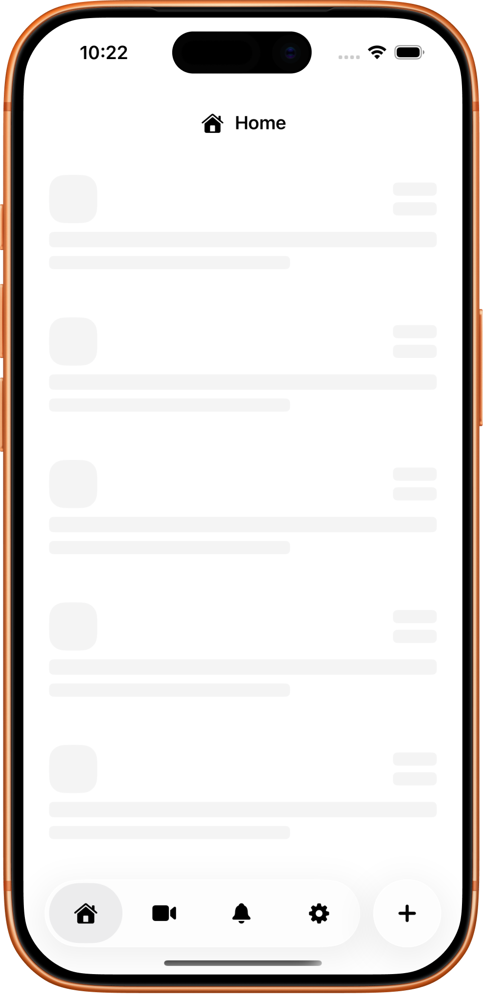
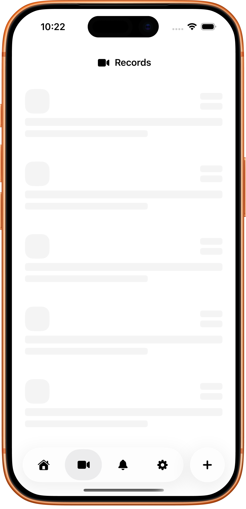
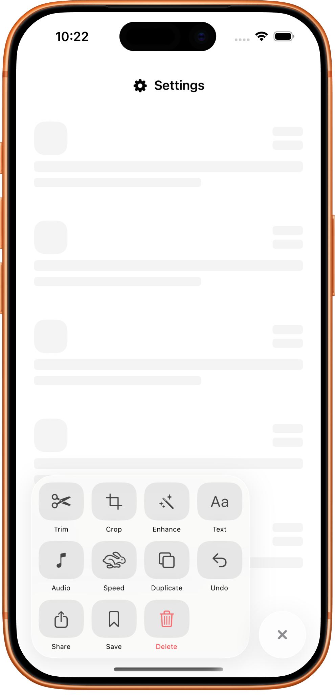
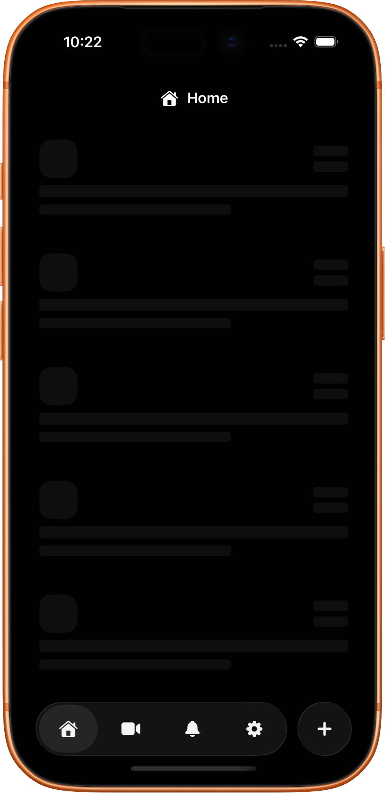
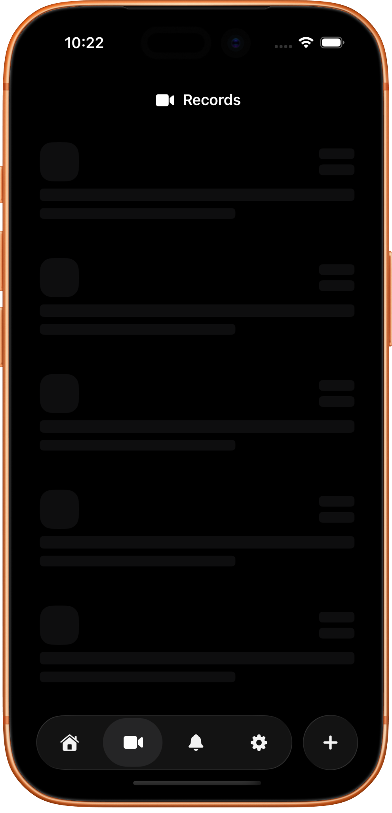
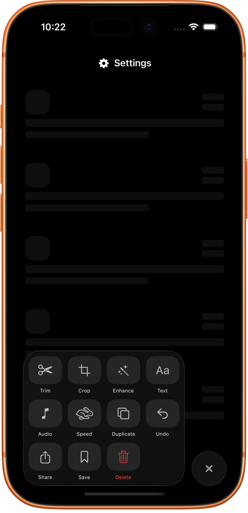

# Morph Tab Bar
A SwiftUI custom tab bar with a morphing glass effect, expandable actions, and dynamic UI components. Designed for modern iOS apps, it provides a smooth and interactive tab bar experience.

<br>
<br>

## Features
- [x] Morphing glass-style tab bar with smooth animations
- [x] Expandable action menu with customizable buttons
- [x] Dynamic height and scaling for content
- [x] Supports multiple tabs with icons and titles
- [x] Fully written in SwiftUI with reusable components

<br>
<br>

### Light Mode:
<p align="start">
  
  &nbsp;&nbsp;&nbsp;
  
  <!-- &nbsp;&nbsp;&nbsp;
   -->
  &nbsp;&nbsp;&nbsp;
  
</p>

### Dark Mode:
<p align="start">
  
  &nbsp;&nbsp;&nbsp;
  
  <!-- &nbsp;&nbsp;&nbsp;
   -->
  &nbsp;&nbsp;&nbsp;
  
</p>

<br>


<br>
<br>

## Components
`MorphTabBar.swift` - Custom morphing tab bar with expandable actions <br>
`MorphGlassView.swift` - Glass morphing effect container <br>
`AppTab.swift` - Enum for defining app tabs and their content <br>
`ActionModel.swift` - Model for actions in expandable tab menu <br>
`SkeletonRow.swift` - Placeholder skeleton row for loading state <br>

<br>
<br>

## Usage
```swift
var body: some View {
    ZStack(alignment: .bottom) {
        activeTab.view
        MorphTabBar(activeTab: $bind, isExpand: $bind, actions: []) { i, action in
            // handle action
        }
    }
    .ignoresSafeArea(.all, edges: .bottom)
}
```
